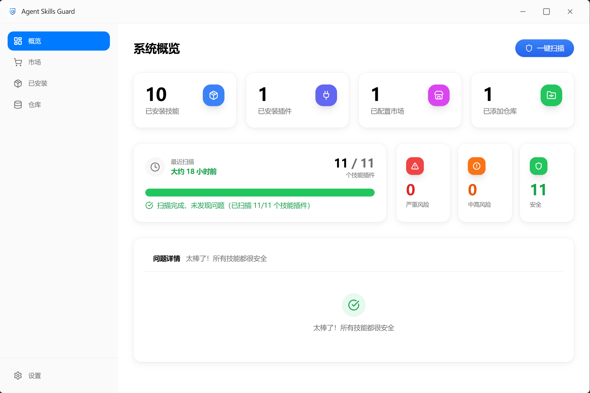
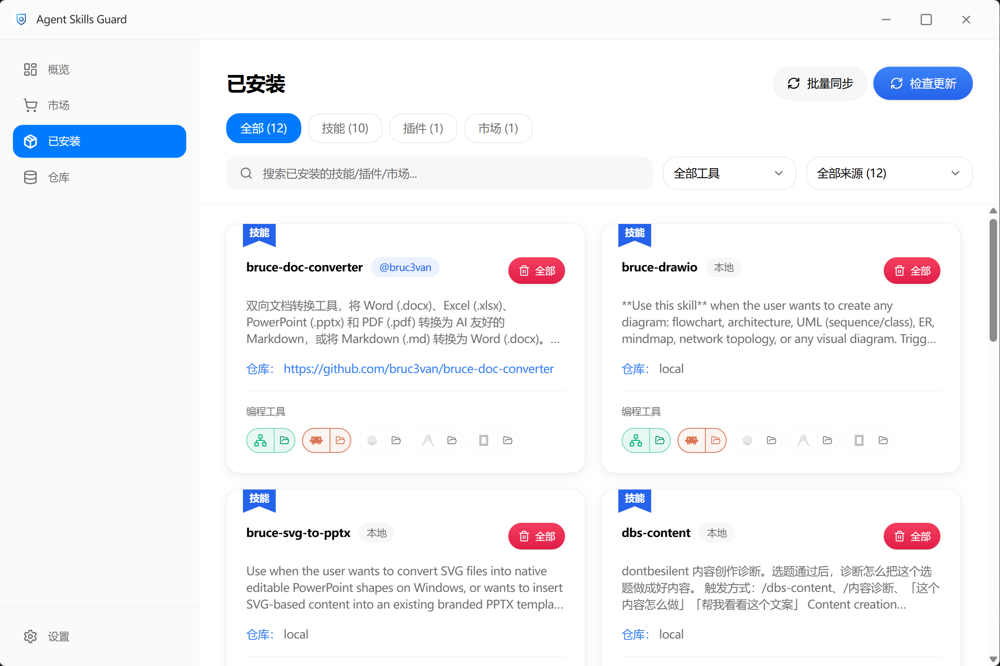
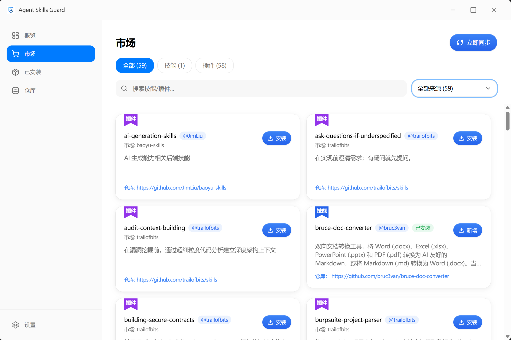
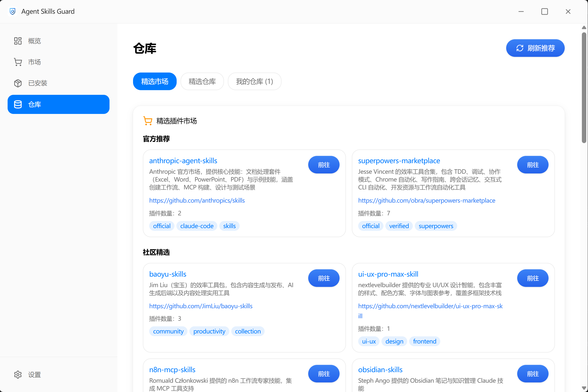

<div align="center">

<a name="readme-top"></a>

# 🛡️ Agent Skills Guard

### Making Claude Code Skills Management as Simple and Secure as an App Store

[](https://github.com/bruc3van/agent-skills-guard/releases)
[](LICENSE)
[](https://github.com/bruc3van/agent-skills-guard/releases)

English | [简体中文](README.md)

</div>

---

## ⚡ Why Agent Skills Guard?

When enjoying Claude Code's AI-assisted programming, do you face these frustrations:

- 🔐 **Security concerns**: Want to install new skills but worried about code risks, don't know how to judge?
- 📦 **Management chaos**: Skills scattered everywhere, don't know which to keep or delete?
- 🔍 **Discovery difficulties**: Don't know where to find quality community skills, missing many great tools?

**Agent Skills Guard** is designed to solve these problems. It transforms the skills world originally hidden in command lines and folders into a **visible, manageable, trustworthy** app store experience.

<div align="center">

**🎯 Core value in three seconds: Visual management + Security scanning + Featured repositories + CLI tool management**

[⭐ Download Now](https://github.com/bruc3van/agent-skills-guard/releases)

</div>

---

## 🌟 Five Core Features

### 🔄 Full Lifecycle Management

Manage Claude Code skills like managing mobile apps, from discovery, installation, updates to uninstallation, all with visual operations.

- ✅ **One-click install**: Install directly from featured or custom repositories
- 🔌 **Plugin-style installation**: Support installing skills as plugins using Claude non-interactive commands, avoiding compatibility issues
- 🔄 **Smart updates**: Automatically detect skill and plugin updates, support online upgrades
- 🗑️ **Easy uninstall**: Support multi-path installation management, clean on demand, with confirmation dialog
- 📂 **Custom paths**: Flexibly choose skill installation locations
- 🔗 **Tool sync**: Sync installed skills to Claude Code, Codex, Antigravity, OpenCode and other programming tools, with batch sync support

### 🛡️ Community-Leading Security Scanning

**All-new multi-layer scanning pipeline engine**, covering 8+ risk categories, multi-step attack chains, Unicode deception, cross-skill coordinated attacks and more cutting-edge detection capabilities.

- 🔍 **8+ risk categories**: Destructive operations, remote code execution, command injection, data exfiltration, privilege escalation, persistence, sensitive information leakage, sensitive file access, and more
- 🔗 **Multi-step attack chain detection**: Taint analysis engine tracking download-execute chains, sensitive file exfiltration and other cross-line attack patterns
- 🎭 **Unicode security detection**: Three-layer detection — homoglyph attacks, zero-width character steganography, invisible control characters
- 🌐 **Cross-skill coordinated attack detection**: Discover data relay, shared malicious domains and other coordinated attack behaviors across multiple skills
- 📦 **File type disguise detection**: 14 magic signature types, prevent binary files disguised as text
- 🗜️ **Safe archive extraction**: ZIP/TAR/Office formats + 8-layer security including ZIP bomb protection
- ✅ **Consistency validation**: Compare declared capabilities vs actual code behavior, detect misleading descriptions
- 📊 **Analyzability assessment**: Scan coverage scoring, identify unanalyzable binary files
- 🔐 **Automatic secret masking**: 9 secret pattern types automatically redacted, prevent key leakage in scan reports
- ⚙️ **Configurable policies**: default/strict/permissive three built-in presets for different scenarios
- 🚫 **Hard-trigger protection**: Directly block high-risk operations, no risk taking

### 🌟 Featured Resource Marketplace

Built-in manually curated quality skills repository, syncs with Claude plugin marketplace, discovering quality resources has never been easier.

- 📚 **Featured skills library**: Manually selected quality skills
- 🔌 **Claude plugin support**: Sync local installed plugins, include in security scanning and risk statistics
- 🌟 **Featured plugin marketplace**: New "Featured Marketplace" tab, supports online refresh and caching
- 🔄 **Auto refresh**: Silent update on startup, keep latest
- ➕ **Custom repositories**: Support adding any GitHub repository

### 💻 Local CLI Tool Management

Automatically discover and manage command-line tools installed via package managers, all in one place.

- 🔍 **Auto Discovery**: Scan CLI tools installed via npm, pnpm, pip, Homebrew, Scoop, Chocolatey
- 🔄 **Update Check**: One-click check for updates across all CLI tools, with batch update support
- 📦 **Smart Merge**: Auto-merge tools from the same Homebrew formula / Scoop package to reduce noise
- 🗑️ **Uninstall**: Uninstall CLI tools directly from the interface
- 📂 **Folder Browse**: Quickly open tool installation directories
- 🏷️ **Categorized View**: Organized by package manager, with search and filtering

### 🎨 Modern Visual Management

Say goodbye to command lines and enjoy the intuitive Apple minimalist interface.

- 🎨 **Apple minimalist theme**: Clean macOS style design
- 📱 **Sidebar navigation**: Intuitive navigation experience
- ⚡ **Smooth animations**: Carefully polished interaction experience
- 🌐 **Bilingual interface**: Complete Chinese and English interface support
- 📐 **Responsive layout**: Perfect adaptation to various screen sizes

---

## 🔗 Related Projects

### 🔍 Agent Scanner Skill

If you like the security scanning feature of Agent Skills Guard, you can also try our Claude Code skill version:

**[agent-scanner-skill](https://github.com/bruc3van/agent-scanner-skill)** - More powerful security scanning with deep dependency analysis, known vulnerability detection, and intelligent risk assessment

No GUI required, perfect for developers who prefer working in the terminal.

---

## 🆚 Traditional Way vs Agent Skills Guard

| Feature                           | Traditional Way                       | Agent Skills Guard                                      |
| --------------------------------- | ------------------------------------- | ------------------------------------------------------- |
| **Discover skills/plugins** | ❌ Aimlessly search GitHub            | ✅ Featured repo + plugin marketplace, one-click browse |
| **Security check**          | ❌ Manual code review, time-consuming | ✅ Multi-layer pipeline auto scan, covering attack chains/Unicode/cross-skill detection |
| **Install skills**          | ❌ Command line, error-prone          | ✅ Visual UI, plugin-style install, click to install    |
| **Manage skills/plugins**   | ❌ Folder digging, unclear usage      | ✅ Intuitive list, clear status                         |
| **Update skills/plugins**   | ❌ Manual check, repetitive           | ✅ Auto detect, batch update                            |
| **Sync to tools**           | ❌ Manually copy to tool directories  | ✅ One-click sync to Claude Code / Codex / Antigravity / OpenCode, batch operations |
| **Uninstall skills**        | ❌ Manual delete, worried leftovers   | ✅ One-click uninstall, confirmation dialog, auto cleanup |
| **CLI tool management**     | ❌ Check each package manager one by one | ✅ Auto discover, unified management, batch update    |

---

## 🚀 Quick Start

### 📥 Installation

Visit [GitHub Releases](https://github.com/bruc3van/agent-skills-guard/releases) to download the latest version:

- **macOS**: Download `.dmg` file, drag to install
- **Windows**: Download `.msi` installer, double-click to install

<div align="center">

*Security warnings on first launch can be safely ignored*

</div>

### 🎯 First Time Use

**Step 1: Browse and Install**

- Browse and search skills in "Skills Marketplace"
- Click "Install", system will automatically perform security scan
- Check security score and scan report, install with peace of mind

**Step 2: Manage Installed Skills**

- One-click scan all skills' security status in "Overview" page
- View details, update or uninstall in "My Skills"

## 💎 Interface Showcase

### 📊 Overview Page

See all skills' security status at a glance, risk category statistics, and issue details clearly.



### 🛡️ Security Scan Report

Detailed scan results, including security score, risk level, problem list.


### 📦 My Skills

View all installed skills, support multi-path management, batch update and uninstall.




### 🛒 Skills Marketplace

Explore and install community skills from featured repositories.



### 🗄️ Repository Configuration

Add and manage skill sources, built-in featured marketplace and GitHub repositories, updated regularly.



---

## 🛡️ Security Scanning Details

### Scanning Mechanism

All-new multi-layer scanning pipeline engine. From file traversal to final report, multiple specialized analyzers work together:

1. **Policy Loading** — Load ScanPolicy (default/strict/permissive presets)
2. **SkillContext Construction** — Unified context object, one-pass file classification, frontmatter parsing, reference extraction
3. **Strict Structure Validation** — 15 directory/file structure checks (optional)
4. **Per-File Scanning** — File type disguise detection → Unicode deception detection → Asset contamination detection → YAML rule matching → Archive deep scan
5. **Context-Level Analysis** — Consistency validation → Multi-step attack chain detection → Analyzability assessment
6. **Post-Processing** — Secret masking + Finding deduplication + Geometric decay scoring

**Technical Highlights:**

- **YAML External Rules** — Rules separated from code, supporting `core_rules.yaml` + `cisco_parity_signatures.yaml` dual rule packs
- **Parallel Scanning** — Parallel scanning technology greatly improves scan speed for local installed skills/plugins
- **Symbolic Link Detection** — Immediately hard-block on symlink discovery, prevent attacks
- **Multi-Format Support** — Support ~80 file extensions including `.js`, `.ts`, `.py`, `.sh`, `.rs`
- **Platform Adaptation** — UTF-16 decoding, full Windows/multi-language support

### Scoring System Principles

#### How is the Security Score Calculated?

The security score uses a **100-point geometric decay deduction mechanism**, starting from 100 points and deducting based on detected risks:

1. **Initial Score**: 100 points (full score)
2. **Risk Deduction**: For each risk detected, deduct points based on its weight and confidence level
3. **Geometric Decay**: Multiple risks use a decay formula, avoiding excessively low scores from simple linear deduction
4. **Same-Rule Deduplication**: Deduct points only once per rule in the same file
5. **Hard-Trigger Protection**: When hard-trigger rules fire, score is capped at 29, directly blocking installation

#### Scoring Example

Assume the following risks are detected:

| Risk Item                   | Weight | Description                         |
| --------------------------- | ------ | ----------------------------------- |
| `rm -rf /` (hard trigger) | 100    | Installation prohibited directly    |
| `curl \| bash`             | 90     | Deduct 90 points                    |
| `eval()`                  | 6      | Deduct 6 points                     |
| `os.system()`             | 6      | Deduct 6 points                     |
| Hardcoded API Key           | 60     | Deduct 60 points                    |
| **Total Score**       | -      | 100 - 90 - 6 - 6 - 60 =**-0** |

Due to the presence of hard-trigger rules, installation is directly blocked.

#### Scoring Levels

- **90-100 (✅ Safe)**: Safe to use

  - No or only very low-risk items
  - No hard-trigger rules detected
- **70-89 (⚠️ Low Risk)**: Minor risk, recommend checking details

  - Few low-risk items
  - Decide whether to use based on needs
- **50-69 (⚠️ Medium Risk)**: Certain risk, use with caution

  - Medium-risk items present
  - Recommend carefully reviewing code before use
- **30-49 (🔴 High Risk)**: High risk, not recommended for installation

  - Multiple high-risk items
  - Strongly recommend finding alternatives
- **0-29 (🚨 Critical Risk)**: Serious threat, installation prohibited

  - Hard-trigger rules triggered
  - System directly blocks installation

### Hard-Trigger Protection Mechanism

**What are Hard-Trigger Rules?**

Hard-trigger rules are "red lines" set by the system. Once triggered, installation is immediately blocked without giving users a chance to take risks. These rules correspond to **extremely dangerous** operations, including:

- 🚨 **Destructive Operations**: `rm -rf /`, disk wiping, formatting, etc.
- 🚨 **Remote Code Execution**: `curl | bash`, reverse shell, PowerShell encoded commands, etc.
- 🚨 **Privilege Escalation**: sudoers file modification
- 🚨 **Persistence Backdoor**: SSH key injection
- 🚨 **Sensitive File Access**: Reading shadow file, Windows credential store

Covering the most common attack vectors.

### Multi-Step Attack Chain Detection

Traditional single-line regex matching cannot detect combined attacks spanning multiple lines. The Pipeline engine uses a **two-tier detection architecture**:

- **Taint Analysis**: Formal source → transform → sink data flow model, tracking 7 taint types (sensitive data, user data, network data, obfuscation, code execution, file write, network send)
- **Heuristic Detectors**: 6 specialized cross-line pattern detectors, including download-execute chains, download→chmod→execute triple chains, sensitive file exfiltration, find -exec, environment variable harvesting, base64 decode execution

### Unicode Security Detection

Three-layer Unicode security detection to prevent malicious code hiding through special characters:

- **Homoglyph Attacks** — Detect ~90 Unicode characters (Cyrillic/Greek/Math) disguised as Latin letters
- **Zero-Width Character Steganography** — Detect 13 zero-width/invisible character types (ZWSP, ZWNJ, ZWJ, BOM, Word Joiner, Soft Hyphen, Variation Selectors, etc.)
- **Invisible Control Characters** — Detect C0 control characters, DEL, C1 control characters

### Cross-Skill Coordinated Attack Detection

In multi-skill environments, detect coordinated attack behaviors across skills:

- **Data Relay Detection** — Pair "credential collector" skills with "network exfiltrator" skills
- **Shared Malicious Domains** — Identify uncommon domains referenced by 2+ skills
- **Complementary Trigger Detection** — Analyze skill description word overlap to identify potential coordinated attack pairs
- **Shared Obfuscation Patterns** — Detect 2+ skills sharing base64_decode/exec/eval and other obfuscation techniques

### File Type Disguise Detection

Pure Rust file magic signature detection (no external dependencies), reading the first 512 bytes to identify 14 content types:

- **Executables**: PE (Windows .exe), ELF (Linux), Mach-O (macOS)
- **Document Formats**: PDF, Office OLE2, Office OOXML
- **Archives**: ZIP, gzip, tar
- **Scripts**: Shell, Python, JavaScript
- **Markup**: HTML, SVG

Alerts trigger when file extension doesn't match actual content (e.g., `.py` file is actually a PE executable → Critical).

### Archive Deep Scanning

Safely extract and scan archive contents with **8 layers of security protection**:

- 🔒 Path traversal detection (reject `..` and absolute paths)
- 💣 ZIP bomb detection (20:1 compression ratio threshold)
- 📊 File count limit (default 500)
- 📦 Total size limit (default 100 MiB)
- 📏 Single entry size limit (25% of total)
- 🪆 Nesting depth limit (default 3 levels)
- 🔗 Symlink detection
- ⚙️ Executable detection

Supported formats: ZIP, TAR, TAR.GZ, Office OOXML (DOCX/XLSX/PPTX). Additional detection for VBA macros and OLE embedded objects in Office documents.

### Consistency Validation

Verify that Skill declarations match actual behavior:

- **Capability Declaration Consistency** — Compare manifest `allowed_tools` with actual code patterns for Read/Write/Bash/Grep/Glob/Network capabilities
- **Description Consistency** — Detect misleading behavior where description claims "offline tool" but code uses network
- **Description Quality** — Detect overly generic, too short, vague, or keyword-stuffed descriptions

### Automatic Secret Masking

Scan reports automatically redact **9 secret pattern types**, preventing sensitive information leakage:

AWS Access Key, GitHub Token, PEM Private Key, JWT Token, Database Connection String, Generic Secret Assignment, Stripe Live/Test Key, OpenAI API Key

### Confidence Grading

To reduce false positives, each risk is marked with a confidence level:

- **🎯 High**: Low possibility of false positives, should focus on
- **🎯 Medium**: Some possibility of false positives, recommend manual review
- **🎯 Low**: High possibility of false positives, for reference only

**Score Adjustment**: Low-confidence risks have lower weights in scoring (High ×1.0, Medium ×0.65, Low ×0.35) to avoid false positives causing excessively low scores.

### Risk Classification

| Category                         | Detection Content                   | Examples                          |
| -------------------------------- | ----------------------------------- | --------------------------------- |
| **Destructive Operations** | Delete system files, disk wipe      | `rm -rf /`, `mkfs`            |
| **Remote Code Execution**  | Pipe execution, deserialization     | `curl \| bash`, `pickle.loads` |
| **Command Injection**      | Dynamic command concatenation       | `eval()`, `os.system()`       |
| **Data Exfiltration**      | Data exfiltration to remote servers | `curl -d @file`                 |
| **Privilege Escalation**   | Escalation operations               | `sudo`, `chmod 777`           |
| **Persistence**            | Backdoor implantation               | `crontab`, SSH key injection    |
| **Sensitive Info Leakage** | Hardcoded keys, Tokens              | AWS Key, GitHub Token             |
| **Sensitive File Access**  | Access system sensitive files       | `~/.ssh/`, `/etc/passwd`      |

### Disclaimer

Security scanning is based on preset rules, designed to help identify potential risks, but cannot guarantee 100% accuracy, and false positives or false negatives may exist. It is recommended to carefully read the skill source code before installation and be extra cautious with skills from untrusted sources. Users assume all consequences of using this program.

---

## 📝 Changelog

[View full changelog](https://github.com/bruc3van/agent-skills-guard/releases)

---

## 📦 Download & Feedback

### Download

- 📦 [GitHub Releases](https://github.com/bruc3van/agent-skills-guard/releases) - Get the latest version

### Contact

Have questions or suggestions? Contact via:

- 💬 [GitHub Issues](https://github.com/bruc3van/agent-skills-guard/issues) - Report issues or suggest features
- 🐦 [X/Twitter](https://x.com/bruc3van) - Follow project updates
- 💬 **Agent Skills Security Community**

<div align="center">


</div>

---

## 🔧 For Developers

If you're a developer and want to build from source or contribute:

```bash
# 1. Clone the project
git clone https://github.com/bruc3van/agent-skills-guard.git
cd agent-skills-guard

# 2. Install dependencies (requires pnpm)
pnpm install

# 3. Run in development mode
pnpm dev

# 4. Build production version
pnpm build
```

**Tech Stack**: React 18 + TypeScript + Tauri 2 + Tailwind CSS

---

## ⭐ Star History

[](https://star-history.com/#bruc3van/agent-skills-guard&Date)

---

## 📜 License

MIT License - Free to use, free to share

---

<div align="center">

Made with ❤️ by [Bruce](https://github.com/bruc3van)

If this project helps you, please give it a ⭐️ Star!

[⬆ Back to top](#readme-top)

</div>
